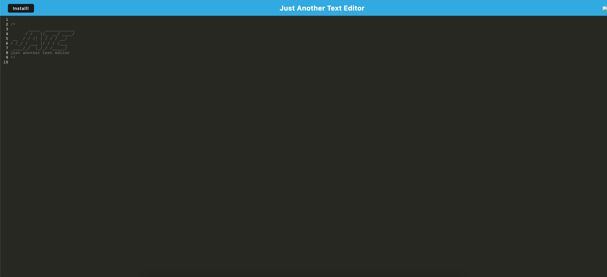

# Text-Editor# Text-Editor

## Description

A text editor JATE, using PWA principles 

Heroku deployed app:
(https://text-jate.herokuapp.com/)

## Table of Contents

- [Installation](#installation)
- [Usage](#usage)
- [License](#license)
- [Badges](#badges)
- [Screenshot](#screenshot)

## Installation

To Install:

Clone the repository from GitHub (https://github.com/bjimenez09/Text-Editor).

Run these command lines in your terminal to install necessary dependencies:

```
npm install
```

## Usage

Run this command 

```
npm run start
```

Direct your browser to "http://localhost:3000/"

## License

This application is covered under the MIT license.

## Badges


## Screenshot

